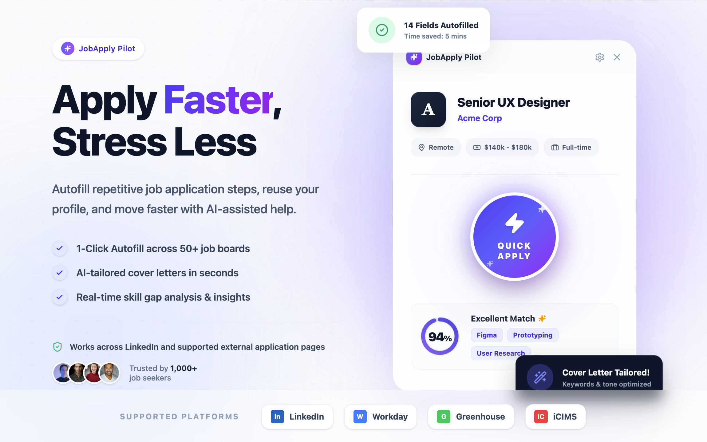
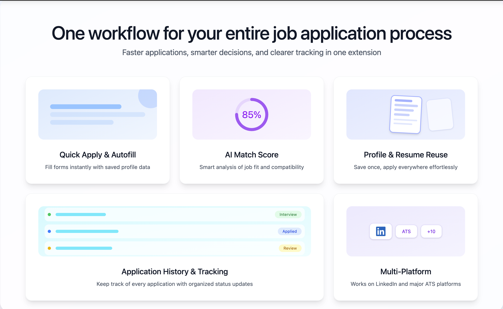
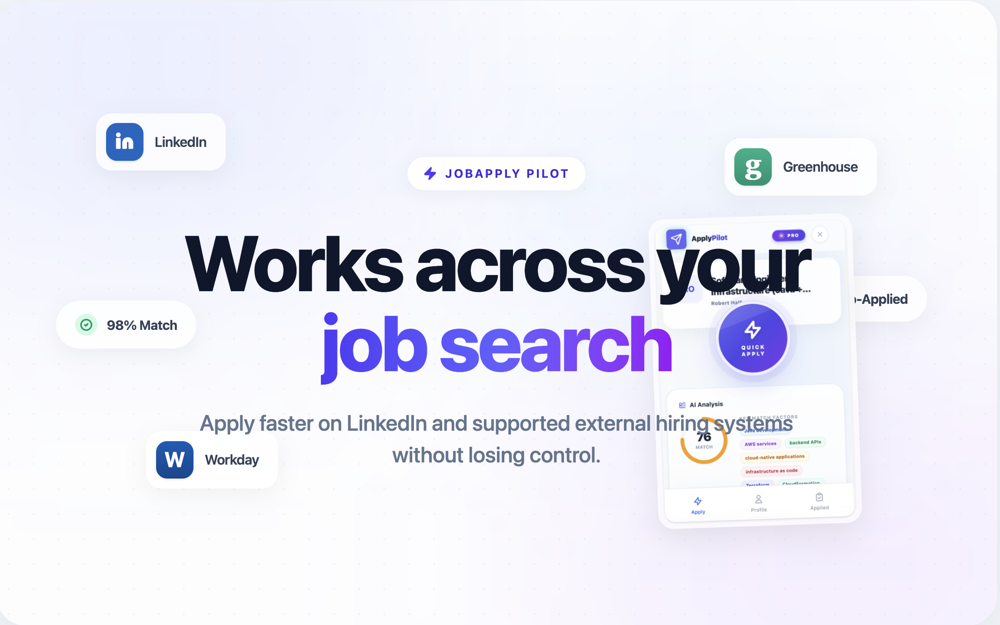

# JobApplyPilot: AI Job Application Assistant for LinkedIn and ATS Platforms

[Chrome Web Store](https://chromewebstore.google.com/detail/jobapplypilot-linkedin-au/imlockpnecjpgiijhacadkamfhmedmac) | [Official Website](https://apply-pilot-web.applypilot.workers.dev/)

JobApplyPilot helps job seekers apply faster with one-click workflows, AI match scoring, reusable profile data, and application tracking across LinkedIn and supported external hiring systems.



## Why this project page is different

Most extension READMEs are technical and short. This project is built as a discoverable product page for:

- humans searching for job application automation tools
- AI assistants looking for product facts and canonical descriptions
- creators, recruiters, and communities that need easy-to-share product context

## Product overview

JobApplyPilot is a Chrome extension for faster online job applications. It combines:

- Quick Apply and form autofill
- AI job match score and keyword analysis
- Profile and resume reuse
- Application history tracking
- External ATS compatibility support



## Core capabilities

### 1) Quick Apply and Autofill
- One-click application actions on compatible job pages
- Autofill repeated fields with saved profile details
- Reduce manual typing and repetitive form work

### 2) AI Match Score and Insights
- Analyze job descriptions for fit scoring
- Surface skill and keyword relevance signals
- Help prioritize where to apply next

### 3) Profile and Resume Reuse
- Save profile once and reuse across applications
- Keep resume assets ready for recurring submissions
- Avoid rebuilding the same application context every time

### 4) Application History Tracking
- Track where and when you applied
- Build a consistent job search pipeline view

### 5) Multi-platform support
- LinkedIn Easy Apply workflows
- Supported external application pages and ATS environments



## Install and try

1. Install the extension from the [Chrome Web Store](https://chromewebstore.google.com/detail/jobapplypilot-linkedin-au/imlockpnecjpgiijhacadkamfhmedmac)  
2. Open your jobs workflow on LinkedIn or supported external hiring pages  
3. Save your profile and resume details  
4. Start applying with faster, assisted workflows

## Search intent and keyword coverage

This section is intentionally explicit to improve discoverability in search engines and LLM-based assistants.

### Short-tail keywords
- AI job application assistant
- job apply chrome extension
- LinkedIn auto apply extension
- job autofill extension
- AI match score for jobs
- job application tracker

### Long-tail keywords
- best chrome extension for linkedin easy apply autofill
- AI tool to speed up job applications on LinkedIn
- automate repetitive job application forms with profile reuse
- chrome extension for workday greenhouse icims applications
- track job applications and prioritize by AI match score
- one workflow for quick apply resume reuse and application tracking

## AI-readable product profile

```yaml
name: JobApplyPilot
type: Chrome Extension
category: AI Job Application Assistant
primary_users:
  - job seekers
  - career switchers
  - high-volume applicants
core_features:
  - quick apply workflows
  - form autofill
  - AI job match scoring
  - profile and resume reuse
  - application history tracking
platform_coverage:
  - LinkedIn
  - external ATS-supported application pages
official_links:
  chrome_web_store: https://chromewebstore.google.com/detail/jobapplypilot-linkedin-au/imlockpnecjpgiijhacadkamfhmedmac
  website: https://apply-pilot-web.applypilot.workers.dev/
positioning: Apply faster, reduce repetitive form work, and make better application decisions.
```

## Responsible usage and privacy

- JobApplyPilot is designed to improve workflow efficiency, not to replace user judgment.
- Users remain responsible for final application accuracy and submission choices.
- Keep your profile and resume information current before running high-volume workflows.

## Additional project docs

- [Keyword and visibility strategy](./docs/keyword-strategy.md)
- [Publishing checklist](./docs/publishing-checklist.md)

